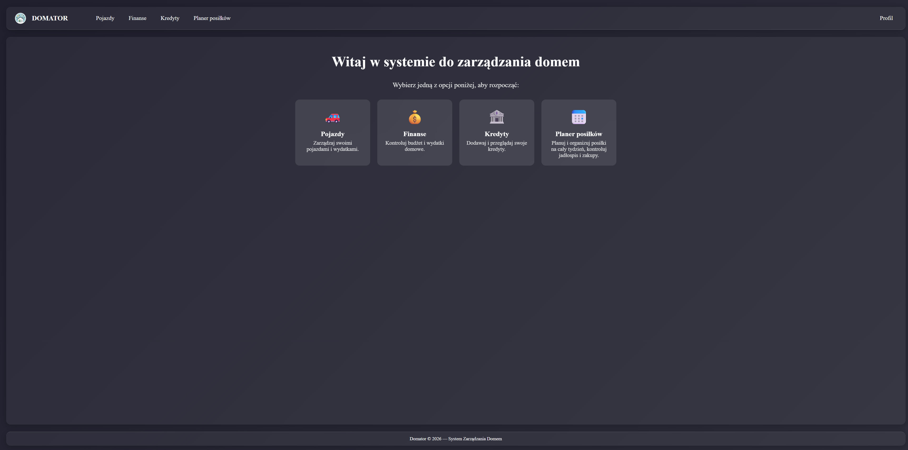
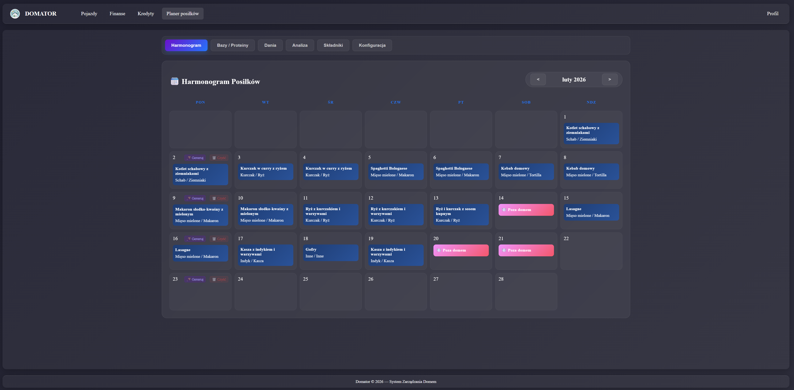
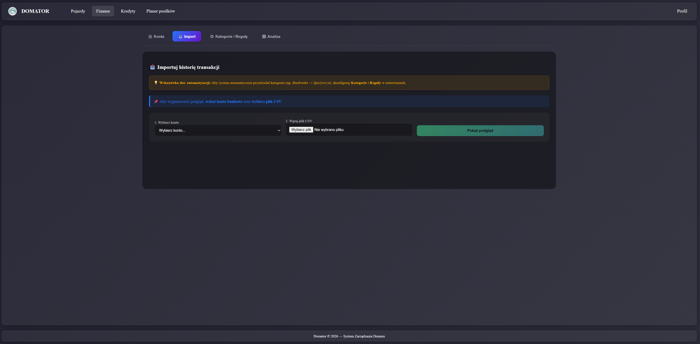

# Domator

**Domator** is a full-stack household management system that centralizes task organization, user management, meal planning, financial tracking, and household operations.  
Built with **FastAPI**, **React + Vite**, and **PostgreSQL**, it leverages JWT-based authentication for security and is fully containerized using Docker for consistent development and production environments.

## Table of Contents

- [Technologies](#technologies)
- [Features](#features)
- [Architecture & Best Practices](#architecture--best-practices)
- [Screenshots](#screenshots)
- [Quick Start](#quick-start)
  - [Local](#local)
  - [Docker](#docker)
- [Testing & Quality Assurance](#testing--quality-assurance)
- [Environment Variables](#environment-variables)
- [Troubleshooting](#troubleshooting)
- [Planned Features](#planned-features)
- [Contribution Guidelines](#contribution-guidelines)

## Technologies

### Backend
- **Python 3.11+** – modern features and type hints for maintainable code  
- **FastAPI** – high-performance async web framework  
- **SQLModel / SQLAlchemy** – ORM with type safety and database abstraction  
- **Pydantic** – data validation and serialization  
- **PostgreSQL 16** – relational database with support for transactions and async queries  
- **Pytest & HTTPX** – unit and integration testing with async support  
- **Argon2 password hashing** – secure credential storage

### Frontend
- **React + Vite** – modular, fast, and maintainable frontend  
- Component-based architecture with reusable, testable UI elements  
- State management via React Context (or Redux if applicable)  
- Form validation and error handling for robust UX  

### Authentication & Security
- JWT-based authentication (access & refresh tokens)  
- Role-ready architecture for fine-grained permissions  
- Secure API endpoints across meals, finances, and loans  

### Infrastructure
- **Docker & Docker Compose** – separate development and production environments  
- Containerized backend and frontend for reproducibility and simplified deployment  
- Environment variable management for security and configuration

## Features

Domator centralizes household management, meal planning, and finances with a full-stack approach. All features are built with security, maintainability, and testability in mind.

### Authentication & Users
- **Registration & Login** – secure JWT-based authentication with access and refresh tokens  
- **Role-ready architecture** – fine-grained access control prepared for future extensions  
- **Password security** – Argon2 hashing ensures strong password storage  

### Loan Management
- **Multi-loan tracking per user** – supports multiple loans with installment and overpayment monitoring  
- **Repayment progress** – calculates remaining balances and expected payoff dates  
- **Ownership & Security** – users can only access and modify their own financial records  

### Vehicle Management
- **Service history tracking** – log maintenance, inspections, and repairs  
- **Insurance management** – OC insurance details and expiration reminders  
- **Notifications** – future-ready for automated service or insurance reminders  

### Meal Planning
- **Weekly meal schedules** – plan meals and assign recipes  
- **Recipes & Shopping List** – generate shopping lists automatically from weekly plan  
- **API Security** – JWT access token required for all meal planning endpoints  

### Household Finances
- **Account Management** – create, edit, and manage multiple bank accounts  
- **CSV Import** – import transactions from Santander and mBank  
- **Automatic Categorization** – configurable rules assign transactions to categories  
- **Financial Insights** – monthly summaries, trend analysis, and spending breakdowns  
- **Secure API** – all finance endpoints protected with JWT; role-ready permissions  

## Architecture & Best Practices

Domator is built with a clear, maintainable architecture following modern full-stack principles:

- **Layered backend**:  
  - **API Layer** – handles HTTP requests/responses, input validation, no business logic  
  - **Service Layer** – implements business rules, orchestrates database operations  
  - **Repository / Data Layer** – ORM models (SQLModel/SQLAlchemy), persistence, queries

- **Authentication & Security**:  
  - JWT access & refresh tokens for stateless authentication  
  - Argon2 hashing for passwords  
  - Role-ready architecture for fine-grained access control  
  - Secure endpoints for all meal planning and financial APIs

- **Frontend architecture**:  
  - Modular React components with Vite  
  - Full integration with backend APIs  
  - State management with React Context (or Redux if applicable)  
  - Form validation and error handling for robust UX

- **Quality & maintainability**:  
  - Comprehensive unit and integration tests with Pytest & HTTPX  
  - Async DB sessions for scalability  
  - Dockerized dev and production environments for reproducibility  
  - Clear separation of concerns, consistent coding standards, and type safety

**Layer responsibilities:**

- **API Layer:** request/response, route validation, no business logic  
- **Service Layer:** business rules, database coordination  
- **Data Layer:** ORM models, persistence logic  

Authentication is stateless, JWT-based, with separate access and refresh tokens.

## Screenshots

### Dashboard


### Meal Planner


### Financial Overview


## Quick Start

Domator can be run locally for development or fully containerized with Docker for a production-like environment. Follow the instructions below to get started quickly.

### Local

**Backend Setup:**

```bash
cd backend
python -m venv .venv
source .venv/bin/activate  # Windows: .venv\Scripts\activate
pip install -r requirements.txt
uvicorn app.main:app --reload
```

* Backend will be available at: http://localhost:8000
* API documentation (OpenAPI / Swagger) available at: http://localhost:8000/docs

**Frontend Setup:**
```bash
cd frontend
npm install
npm run dev
```

* Frontend will be available at: http://localhost:5173
* Ensure .env variable VITE_API_URL points to your local backend (default: http://localhost:8000)

### Docker

Domator provides fully containerized environments for development and production using Docker Compose.

#### Development Environment:
```bash
docker-compose -f docker-compose.dev.yml up --build
```
* Includes backend, frontend, and PostgreSQL containers
* Changes in backend/frontend code will automatically reload (hot reload)

#### Production Environment:
```bash
docker-compose -f docker-compose.prod.yml up -d --build
```
* Runs all containers in detached mode
* Optimized images for performance and minimal footprint

#### Stopping Containers:
```bash
docker-compose down
```

#### Viewing Logs:
```bash
docker-compose logs -f backend
docker-compose logs -f frontend
```
Logs help debugging issues in local or production environment

## Testing & Quality Assurance

Domator is built with maintainability, reliability, and correctness in mind. The project includes comprehensive testing for both backend and frontend to ensure stable releases.

### Backend Testing

- **Unit Tests** – validate individual functions, services, and repositories using **Pytest**.  
- **Integration Tests** – test interactions between API endpoints, services, and the database with **HTTPX async client**.  
- **Database Testing** – uses async DB sessions to verify correct persistence, constraints, and data types (e.g., Decimal for finances).  
- **Security & Ownership** – tests ensure users can only access and modify their own resources.  

#### Run all backend tests:

```bash
cd backend
python -m pytest
```

#### Run specific test modules:

```bash
pytest tests/test_api/test_auth.py           # Authentication
pytest tests/test_api/test_loan.py           # Loan management CRUD & ownership
pytest tests/test_api/test_payment.py        # Payment processing & history logic
pytest tests/test_api/test_loan_payment_integration.py  # Cross-module financial calculations
```

#### Debugging Tests: use -s for detailed output:

```bash
pytest tests/test_api/test_loan_payment_integration.py -s
```

### Frontend Testing
* Component Testing – verify React components render correctly and handle state changes.
* Integration with API – ensure frontend correctly interacts with backend endpoints, including JWT-protected APIs.
* Form Validation & UX – automated tests for forms, input validation, and error handling.

#### Run frontend tests (if configured):

```bash
cd frontend
npm run test
```

### Quality Assurance Practices
* Type Safety – Python type hints and React TypeScript/PropTypes where applicable.
* Code Reviews & Linting – ensure consistent style and maintainable code.
* Dockerized Test Environments – tests run inside containers to replicate production settings.
* Continuous Integration Ready – structure and scripts allow integration with CI pipelines (GitHub Actions, GitLab CI, etc.).
* These measures ensure Domator remains robust, maintainable, and secure as new features are added.

## Environment Variables

Domator relies on environment variables to configure backend, frontend, and Docker environments. Properly setting these ensures security, reproducibility, and flexibility.

### Backend (.env)
```text
APP_NAME=Domator
DEBUG=True
POSTGRES_USER=your_db_user
POSTGRES_PASSWORD=your_db_password
POSTGRES_DB=domator
POSTGRES_HOST=localhost
POSTGRES_PORT=5432
JWT_SECRET_KEY=your_jwt_secret
JWT_ALGORITHM=HS256
ACCESS_TOKEN_EXPIRE_MINUTES=60
REFRESH_TOKEN_EXPIRE_DAYS=7
CORS_ORIGINS=http://localhost:5173
```

### Frontend (.env)
```text
VITE_API_URL=http://localhost:8000
```

### Docker (.env)
```text
POSTGRES_PORT=5432
```

⚠️ Ensure that .env files are never committed to version control if they contain sensitive credentials.

## Troubleshooting

### If you encounter issues while running Domator, check the following:
* Environment Variables
* Make sure all required variables are set correctly for backend, frontend, and Docker.
* Database Connectivity
* Ensure PostgreSQL is running and accessible on the configured host/port.
* Check credentials and database name.
* Backend Issues
* View backend logs: docker-compose logs -f backend or uvicorn app.main:app --reload for local dev
* Verify that required Python packages are installed: pip install -r requirements.txt
* Frontend Issues
* View frontend logs: docker-compose logs -f frontend or npm run dev locally
* Ensure VITE_API_URL points to the correct backend URL
* Docker Issues
* Remove existing containers if stuck: docker-compose down --volumes
* Rebuild images if errors persist: docker-compose up --build
* API Authentication Errors
* Ensure JWT access tokens are provided for protected endpoints
* Refresh expired tokens or check token configuration in .env

## Planned Features

Domator is designed to evolve with additional functionality to improve household management and user experience. Upcoming features include:

- **Notification System**  
  - Push and email reminders for meal plans, loan repayments, and vehicle services  
  - Configurable notification preferences per user  

- **Advanced Financial Analytics**  
  - Predictive insights for budgeting and spending trends  
  - Visual dashboards and exportable reports  

- **User Customization**  
  - Personalized dashboards and widget configuration  
  - Dark/light mode and interface language preferences  

- **Enhanced Security & Access Control**  
  - Multi-factor authentication for sensitive operations  
  - Role-based permissions with granular access to modules  

- **Cross-Module Integrations**  
  - Linking meal planning, finances, and household tasks for automated suggestions  
  - API hooks for third-party services (banks, recipe APIs, calendars)

> These features are planned for future releases and aim to increase usability, automation, and security while maintaining a clean and scalable architecture.